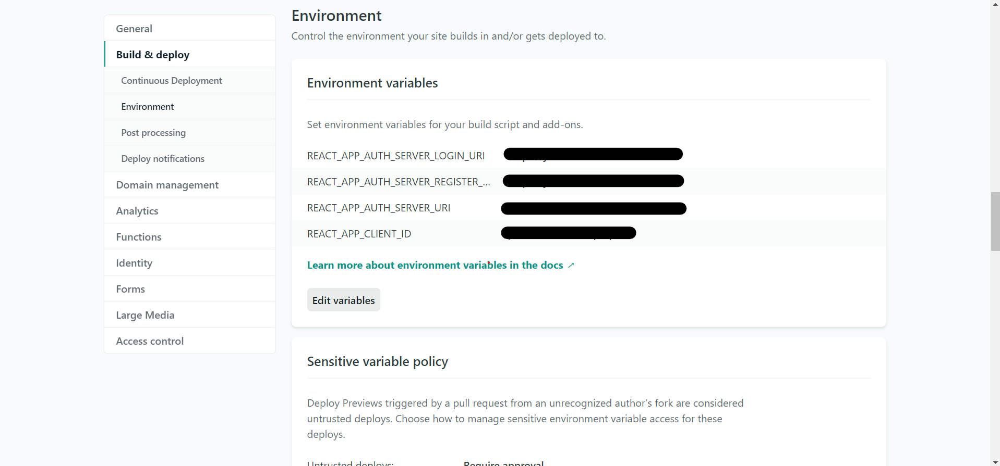

# Journal de bord web client
[](https://app.netlify.com/sites/journal-de-bord/deploys)

This project is a single page application inteded to provide a web client for the Journal de bord project. It is developed using React and TypeScript.

## Getting started
The project documentation can be found [here](https://farci-logan.gitbook.io/journal-de-bord/). Note that you can find the documentation concerning this partical repository in the frontend section.

## Installation
### Configuration
This web client is published on Netlify. This section focuses on this platform. The configuration is easy. Netlify documentation explains how it is done right [here](https://docs.netlify.com/configure-builds/environment-variables/#declare-variables).

## Development
### Configuration
#### How to configure
```
# Clone or download the project
git clone https://github.com/Lofaloa/journal-de-bord-spa.git

# Be sure to set your working directory to the project root
cd journal-de-bord-spa

# .env.example is an existing template for the .env file. The variables are
# required for the project to run
cp .env.example .env

# Edit the .env file and set the variables values
vi .env

# And run it!
npm start
```

### Environment Variables
- ```REACT_APP_AUTH_SERVER__URI```: is the root URI of the authorization server.
- ```REACT_APP_CLIENT_ID```: is the identifier of this web client registered in your authorization server.
- ```REACT_APP_AUTH_SERVER_TOKEN_URI```: is the authorization server endpoint that provide this client with an access token.
- ```REACT_APP_AUTH_SERVER_LOGIN_URI```: is the authorization server endpoint that provide this client with a login page.

The custom environment variables are set following the [React documentation](https://create-react-app.dev/docs/adding-custom-environment-variables/). Their value can be accessed as follows `process.env["VARIABLE_NAME"]`.

#### Example
This example can be used with a Keycloak authorization server. This is currently the only server that was tested with the application.
```
REACT_APP_AUTH_SERVER_URI=https://authorization-server.com/auth/realms/realmname
REACT_APP_RESOURCE_SERVER_URI=https://resource-server.com/
REACT_APP_CLIENT_ID=my-local-application-client-id
REACT_APP_AUTH_SERVER_LOGIN_URI=https://authorization-server.com/auth/realms/realmname/protocol/openid-connect/auth
REACT_APP_AUTH_SERVER_REGISTER_URI=https://authorization-server.com/auth/realms/realmname/protocol/openid-connect/registrations
```

## Deployment
This web client is published on Netlify. This section focuses on this platform. The configuration is easy. Netlify documentation explains how it is done right [here](https://docs.netlify.com/configure-builds/environment-variables/#declare-variables).

### How to
Netlify explains how to publish on this [tutorial](https://www.netlify.com/blog/2016/09/29/a-step-by-step-guide-deploying-on-netlify/). Currently the project is automatically deployed on Netlify when a branch is merged to the master. I still need to configure the environment variables manually.

To set the variables (as described in the previous section), go to:
1. Go to [app.netlify.com](https://app.netlify.com)
2. Open the site to set the variables for
3. Go to Site *Settings*
4. Go to the *Build & Deploy* section
5. Go to *Environment*

You should find this following screen. There you go 😁! Go ahead and set the required environment variables.



## Security
The single page application needs to access a custom resource server on behalf of its users. The authorization server is using Keycloak. Different options exist as to how to implement a OpenID Connect client.

- [**Keycloak JavaScript adapter**](https://www.keycloak.org/docs/latest/securing_apps/#javascript-adapter-reference)
- [**oidc-client**](https://github.com/IdentityModel/oidc-client-js)

This project used the second. It is the most practical one.

10/07/2020
